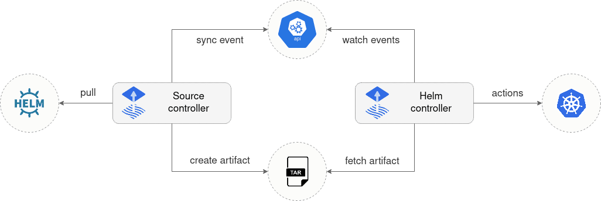

# helm-controller

The helm-controller is a Kubernetes operator, allowing one to declaratively
manage Helm chart releases. It is part of a composable [GitOps toolkit](https://toolkit.fluxcd.io)
and depends on [source-controller][] to acquire the Helm charts from Helm
repositories.

The desired state of a Helm release is described through a Kubernetes Custom
Resource named `HelmRelease`. Based on the creation, mutation or removal of a
`HelmRelease` resource in the cluster, Helm actions are performed by the
operator.

## Features

* Watches for `HelmRelease` objects and generates `HelmChart` objects
* Supports `HelmChart` artifacts produced from `HelmRepository`,
  `GitRepository` and `Bucket` sources
* Fetches artifacts produced by [source-controller][] from `HelmChart`
  objects
* Watches `HelmChart` objects for revision changes (including semver
  ranges for charts from `HelmRepository` sources)
* Performs automated Helm actions, including Helm tests, rollbacks and
  uninstalls
* Offers extensive configuration options for automated remediation
  (rollback, uninstall, retry) on failed Helm install, upgrade or test
  actions
* Runs Helm install/upgrade in a specific order, taking into account the
  depends-on relationship defined in a set of `HelmRelease` objects
* Reports Helm release statuses (alerting provided by
  [notification-controller][])

## Guides

* [Get started with GitOps Toolkit](https://toolkit.fluxcd.io/get-started/)
* [Manage Helm Releases](https://toolkit.fluxcd.io/guides/helmreleases/)
* [Setup Notifications](https://toolkit.fluxcd.io/guides/notifications/)
* Nov 13: Join our planned workshop on migrating from Helm Operator to Helm Controller (part of [GitOps Days EMEA](https://www.gitopsdays.com/)).

## Specifications

* [API](docs/spec/v2beta1/README.md)
* [Controller](docs/spec/README.md)

[source-controller]: https://github.com/fluxcd/source-controller
[notification-controller]: https://github.com/fluxcd/notification-controller
